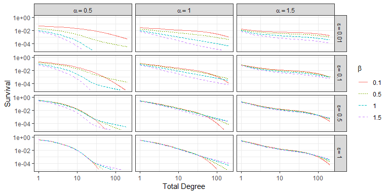
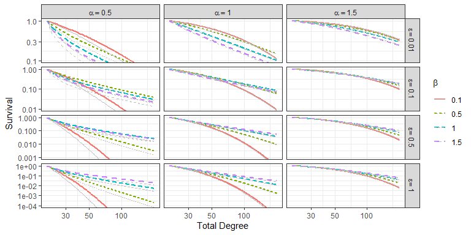
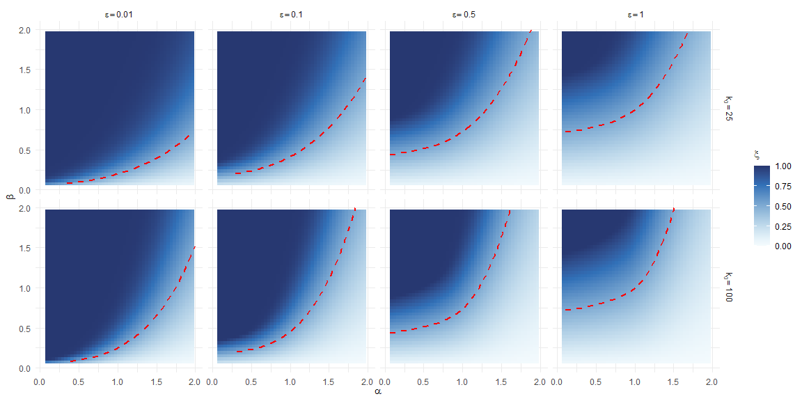
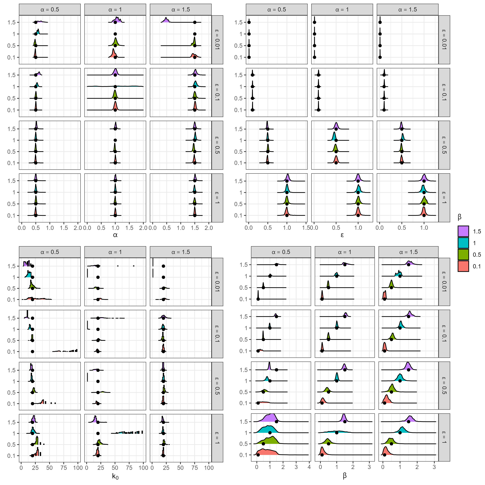
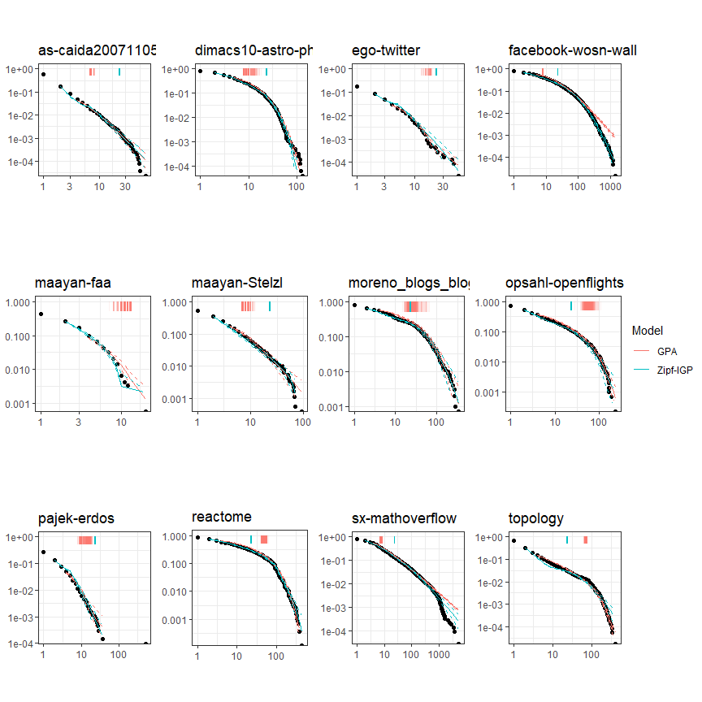
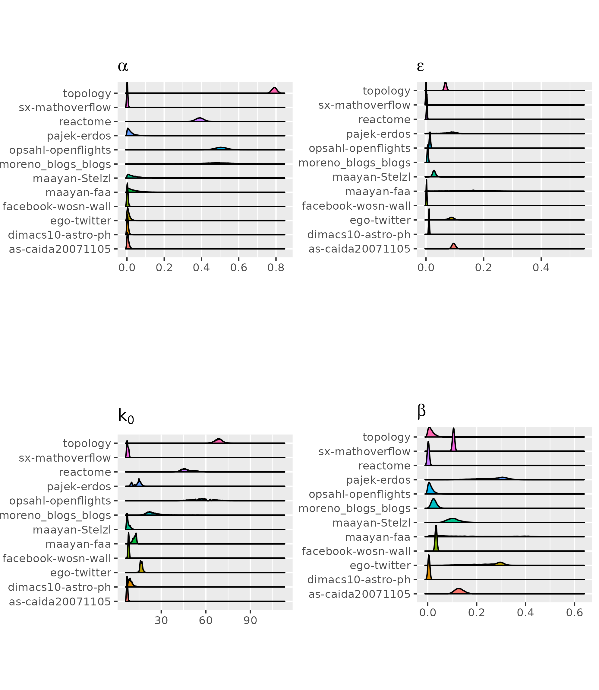
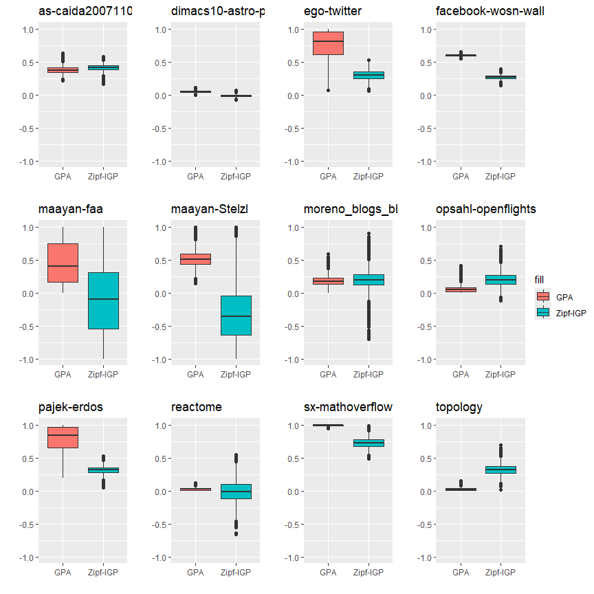
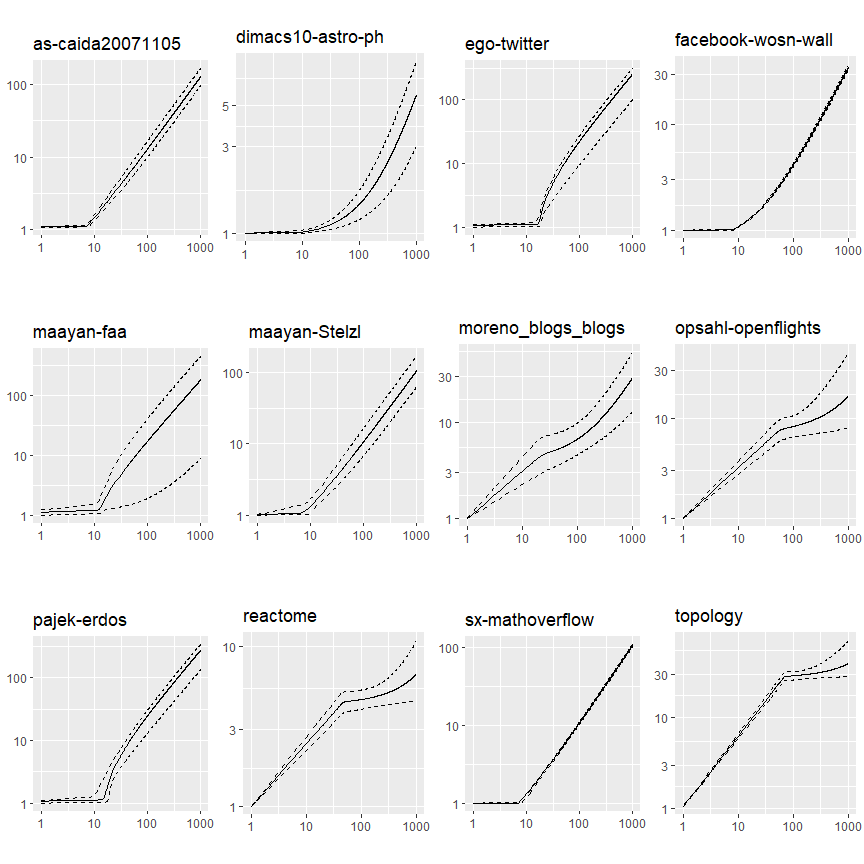

\newpage

::: {.cell}

:::

# Introduction

Networks have become powerful tools for representing and analysing complex systems, with uses in a large array of fields. In network science and statistics, they have been studied by various families of models, from stochastic block models for detecting communities online [@Latouche11], to exponential random graph models (ERGMs) for analysing the global trade network [@Setayesh22], and mechanistic models for investigating patterns in neural systems [@Betzel17].

Amid the recent rise of interest in networks, there has been a debate on whether most real networks are scale-free. Claiming a real network is scale-free is equivalent to saying that its degree distribution follows a power law, that is the fraction of nodes with degree $k$ is proportional to $k^{-\alpha}$, and therefore has a regularly varying tail with tail index $\alpha$. On the side against the claim is @Broido_2019 who compared the fits of a power law model against that of several non-scale-free models to nearly a thousand networks, only to find strong evidence for scale-freeness in four percent and weak evidence in over half of the networks, thus claiming that scale-free networks do not make up a majority in real networks. On the other side of this debate is @Voitalov_2019 who disagrees and claims that these networks are not nearly as rare and only appear to so as a result of an unrealistic expectation of a power law without deviations or noise. Additional evidence of these deviations from a power law is shown by @Lee24 who demonstrate that a lot of networks are partially scale-free, in that the body of the degree distribution is often modelled well by a power law, while the tail is lighter than what is implied by the body, albeit still regularly varying. Nevertheless, most studies into the appropriateness of a power law for the degrees of real networks, the aforementioned references included, have been largely descriptive in the sense that no information about the growth of the networks is revealed.

The popularity of using the power law for network degrees can be traced back to the preferential attachment (PA) model popularised by @Barabasi99. In the general model, as new nodes join the network, an existing node with degree $k$ gains edges at a rate proportional to $b(k)$, where $b(\cdot)$ is a non-negative preference function. @Barabasi99 showed that, when $b(k) = k + 1$, in the limit the resulting degree distribution is regularly varying with index 2. Subsequently, if a real network is shown to be scale-free, one can loosely justify PA as the underlying mechanism of its growth.

The model from @Barabasi99 provided the foundations for various generalisations — @krapivsky01 considered $b(k) = (k+1)^\alpha$, and showed that the degree distribution is not regularly varying (and therefore not following the power law) when $0<\alpha<1$, and when $\alpha>1$ a finite number of nodes end up with all edges after a certain point resulting in a degenerate degree distribution. @wang2022random returns to a linear preference function of the form $b(k) = k+\varepsilon$ but adds the possibility for reciprocal edges to be sent, resulting in the joint distribution of in-degree and out-degree being multivariate regularly varying and having the property of hidden regular variation. @rudas07 follows in the footsteps of @krapivsky01, by considering a PA tree and using theory from continuous branching processes, derives a limiting degree distribution in terms of the preference function $b(\cdot)$. Nevertheless, research in this area tends to only focus on the theoretical asymptotic results of network growth models with little analysis of real networks.

This paper aims to address the gap between the applied and theoretical works, by asking if a network is assumed to come from a PA model, can we use the degree distribution alone to directly infer the parameters of the the preference function and learn about the growth mechanisms? Moreover, proper consideration is given to the tail of the degree distribution, because otherwise the effects of the largest degrees, which correspond to the most influential nodes, deviating from the power law will be discounted.

As the degrees of networks are discrete values, we will use methods from discrete extreme value theory, in particular those by @shimura12, who provided theoretical guarantees for a discrete distribution to be regularly varying or not. Using these results, we demonstrate how the tail of the degree distribution is affected by $b(\cdot)$, and subsequently propose a class of preference functions that is tail realistic for real networks. These analytical results enables the likelihood of the degree distribution to be expressed in terms of the parameters of $b(\cdot)$, which in turn allows the underlying mechanism of the network, assumed to grow according to PA, to be inferred directly.

The remainder of the paper is as follows: @sec-tail gives a detailed description of the PA model alongside the theoretical results for the survival function of the limiting degree distribution, with a focus on the tail behaviour in terms of the preference function $b(\cdot)$. A class of asymptotically linear preference functions will be introduced and shown to guarantee regular variation in the degree distribution while remaining flexible up until a threshold. @sec-model utilises the proposed preference function and illustrates numerically how the tail index of the degree distribution varies with the model parameters. The simulation study in @sec-sim demonstrates that the parameters can be recovered from fitting the model to only the degree distribution. @sec-real fits the model to some real data and provides posterior estimates for the preference function. @sec-conc provides a discussion of this paper and possible avenues for future work.

\newpage

# Tail Behaviour of Preferential Attachment Model {#sec-tail}

The model that we will focus on in this paper is the General Preferential Attachment (GPA) model in @rudas07 and is defined as follows:

Starting at time $t=0$ with an initial network of $m$ vertices that each have no edges, at times $t=1,2,\ldots$ a new vertex is added to the network bringing with it $m$ directed edges from the new vertex; the target for each of these edges are selected from the vertices already in the network with weights proportional to some non-decreasing preference function $b(\cdot)$ of their degree, where $b: \mathbb N \mapsto \mathbb R^+\setminus\{0\}$ is such that:

$$
\sum_{k=0}^\infty\frac{1}{b(k)} = \infty.
$$ {#eq-condb2}

Special cases of this model include the Barabási-Albert (BA) model when $b(k) = k+1$, which in the limit of $t\rightarrow \infty$ leads to a power-law degree distribution with tail index 2, and the Uniform Attachment (UA) model where $b(k)=c$ leading to a degree distribution that is not regularly varying.

The survival function of the limiting degree distribution, called the limiting survival hereafter, under condition [-@eq-condb2] can be analytically derived in the case where $m=1$, which is presented below.

Consider a continuous time branching process $\zeta(t)$ driven by a Markovian pure birth process, with $\zeta(0)=0$ and birth rates depending on a non-negative function $b(\cdot)$:

$$
\Pr(\zeta(t+\text{d}t)=k+1|\zeta(t)=k) = b(k)\text{d}t + o(\text{d}t).
$$ Now let $\Upsilon(t)$ be the tree determined by $\zeta(t)$ as follows: $\Upsilon(t)=\{\emptyset\}$ and $\Upsilon(t)=G$ where each existing node $x$ in $\Upsilon(t)$ gives birth to a child with rate $b(\mathrm{deg}(x, \Upsilon(t))$ independently of the other nodes where $\mathrm{deg}(x, \Upsilon(t))$ is the degree of node $x$ in the tree $\Upsilon(t)$ at time $t$, denote by $\Upsilon(t)_{\downarrow x}$ the tree when treating node $x$ as the root.

Theorem 1 from @rudas07 states that for the tree $\Upsilon(t)$ at time $t$ and a characteristic function of the tree $\varphi(\cdot)$ :

$$
\lim*{t*\rightarrow\infty}\frac{1}{|\Upsilon(t)|}\sum{x\in\Upsilon(t)}\varphi(\Upsilon(t)\_{\downarrow x}) = \lambda\^\* \int\_0\infty e{-\lambda\^\* t}\mathbb E\left[\varphi(\Upsilon(t))\right]\text{d}t 
$$ {#eq-survlim} 

where $\lambda^*$ satisfies $\hat\rho(\lambda^*)=1$ and $\hat\rho$ is the Laplace transform of the density of the point process associated with the pure birth process that corresponds to the growth of an individual node, that is $\hat\rho(\lambda) \coloneq \int_0^\infty e^{-\lambda t}\rho(t)\mathrm{d}t$.

The limiting survival can be viewed as the limit of the empirical proportion of vertices with degree over a threshold $k\in\mathbb N$, that is:

$$
\bar F(k) = \lim_{t\rightarrow\infty}\frac{\sum_{x\in\Upsilon(t)}\mathbb I\left\{\text{deg}(x,\Upsilon(t)_{\downarrow x})>k\right\}}{\sum_{x\in\Upsilon(t)} 1}
$$ which can also be written using @eq-survlim as:

$$
\bar F(k) = \frac{\int_0^\infty e^{-\lambda^* t}\mathbb E\left[\mathbb I\left\{\text{deg}(x,\Upsilon(t))>k\right\}\right]\text{d}t}{\int_0^\infty e^{-\lambda^* t}\text{d}t} = \prod_{i=0}^k\frac{b(i)}{\lambda^* + b(i)}.
$$ {#eq-surv-origin}

Therefore, the corresponding probability mass function of the degree distribution $f(k) = \bar F(k-1) - \bar F(k)$ is

$$
f(k) = \frac{\lambda^*}{\lambda^* + b(k)}\prod_{i=0}^{k-1}\frac{b(i)}{\lambda^*+b(i)}.
$$ {#eq-pmf-origin}

We are interested in how the tail behaviour of the discrete limiting degree distribution is affected by the preference function $b$. In order to study this, we use the quantity $\Omega(F, k)$ as stated in @shimura12 and is repeated below:

For a discrete distribution $F$ with survival function $\bar F$ and $k\in\mathbb Z^+$ let

$$
\Omega(F,k) = \left(\log\displaystyle\frac{\bar F (k+1)}{\bar F (k+2)}\right)^{-1} - \left(\log\displaystyle\frac{\bar F (k)}{\bar F (k+1)}\right)^{-1}.
$$

The following proposition gives the limiting behaviour of $\Omega(F,k)$ when \$F\$ is a limiting degree distribution resulting from the GPA model with preference function $b(\cdot)$.

::: {#prp-omega}
If $\bar F(k) = \prod_{i=0}^k\frac{b(i)}{\lambda^* + b(i)}$ and $b(k) \rightarrow \infty$ as $k\rightarrow \infty$, then $$
\lim_{k\rightarrow\infty}\Omega(F,k) = \lim_{k\rightarrow\infty}\frac{b(k+1)-b(k)}{\lambda^*}.
$$
:::

:::{#rem-omega}
If instead $b(k)\rightarrow u$ for $u>0$, then $\Omega(F, k) = 0$ 
:::

See Appendix [-@sec-proofs] for the details of the proof.

@shimura12 states that if $\lim_{k\rightarrow\infty} \Omega(F,k) = 1/\alpha$ ($\alpha>0$), then $F$ is regularly varying with $\bar F(k) \sim k^{-\alpha}$. On the other hand, if $\lim_{k\rightarrow\infty} \Omega(F,k) = 0$ then we will refer to the distribution as light-tailed.

@prp-omega aligns with the result from @krapivsky01 demonstrating that a sub-linear preference function will lead to a light-tailed distribution, as $\lim_{k\rightarrow\infty} b(k+1)-b(k) = 0$ if $b(k)=k^\alpha$ where $\alpha < 1$. @prp-omega also aligns with the fact that BA model produces a regularly varying degree distribution, with tail index 2, by considering the preference function $b(k) = k + \varepsilon$, as $\lim_{k\rightarrow\infty}b(k+1)-b(k)=1$, leaving the tail index to be $1/\lambda^*$ which using $\hat\rho$ can be found to be $1/2$. So, in order for the degree distribution to be regularly varying we need that the limit $\lim_{k\rightarrow\infty} b(k+1)-b(k)$ exists and is positive. The following corollary of @prp-omega determines the class of functions that will result in regular varying degree distributions.

::: {#cor-omega2}
The limiting survival, $\bar F(k)$, of degrees in a network generated according to GPA is regularly varying if and only if $\lim_{k\rightarrow\infty}[b(k+1)-b(k)] = c$ for some $c>0$ and has tail index $\lambda^*/c$ where $\lambda^*$ is the malthusian parameter of the analagous branching process. Additionally, $\bar F(k)$ is light tailed if and only if $\lim_{k\rightarrow\infty}[b(k+1)-b(k)] = 0$.
:::

:::{#exm-omega2-1}
If $b(k) = \beta k + \varepsilon$, then $\lim_{k\rightarrow\infty}[b(k+1)-b(k)] = \beta$ and hence the resulting limiting survival is regularly varying with tail index $\lambda^*/\beta$, when $\beta=\varepsilon=1$ this is exactly the BA model and lines up with established results.
:::

:::{#exm-omega2-2}
If $b(k) = \log(k+1)$, then $\lim_{k\rightarrow\infty}[b(k+1)-b(k)] = 0$ and the limiting survival is be light tailed
:::

Using this result we can understand how the preference function is directly connected with the tail behaviour of the degree distribution. Specifically, regular variation is achieved if and only if $b(k)$ is asymptotically linear with $k$. We use this result to create a preference function that guarantees regular variation in the tail of the degree distribution, aligning with analysis of real networks, whilst allowing for the tail to deviate from the shape implied by the body. This gives the model the capability to produce realistic behaviour in the degrees like what was in @Lee24 by using a piecewise function inspired by the observed deviation from the power law after a certain threshold:

$$
b(k) = \begin{cases}
k^\alpha + \varepsilon,&k<k_0,\\
k_0^\alpha + \varepsilon + \beta(k-k_0), &k\ge k_0
\end{cases}
$$ {#eq-pref} for $\alpha,\beta, \varepsilon>0$ and $k_0\in\mathbb N$.

Using @prp-omega, we can show that $\lim_{n\rightarrow\infty}\Omega(F,k)=\lambda^{*}/\beta$, meaning the degree distribution obtained using this preference function is regularly varying with tail index $\lambda^*/\beta$.

\newpage

# A PA Model with Flexible Regular Variation {#sec-model}

In the previous section, we found that using an asymptotically linear preference function allows for the inclusion of sub/super-linear behaviour below the threshold, while simultaneously guaranteeing regular variation of the degrees. In this section, we demonstrate the flexibility of the preference function in @eq-pref, with regard to the tail behaviour of the limiting degree distribution. Using @eq-surv-origin, the limiting survival is

$$
\bar F(k) = \begin{cases}
\prod_{i=0}^{k}\frac{i^\alpha + \varepsilon}{\lambda^*+i^\alpha + \varepsilon},&k<k_0,\\
\left(\prod_{i=0}^{k_0-1}\frac{i^\alpha + \varepsilon}{\lambda^*+i^\alpha + \varepsilon}\right)\frac{\Gamma(\lambda^*+k_0^\alpha + \varepsilon)/\beta)}{\Gamma\left((k_0^\alpha + \varepsilon)/\beta\right)} \frac{\Gamma\left(k-k_0 + 1 +\frac{k_0^\alpha + \varepsilon}{\beta}\right)}{\Gamma\left(k-k_0 + 1 +\frac{\lambda^* +k_0^\alpha + \varepsilon}{\beta}\right)},&k\ge k_0,
\end{cases}
$$ {#eq-polysurv}

with $\lambda^*$ satisfying $\hat \rho(\lambda^*)=1$ where

$$
\hat\rho(\lambda) = \sum_{n=0}^{k_0}\prod_{i=0}^{n-1}\frac{i^\alpha + \varepsilon}{\lambda+i^\alpha + \varepsilon} + \left(\frac{k_0^\alpha + \varepsilon}{\lambda-\beta}\right)\prod_{i=0}^{k_0-1}\frac{i^\alpha + \varepsilon}{\lambda + i^\alpha + \varepsilon} 
$$ {#eq-rho}

which has to be solved numerically for most parameter choices. Also, note that $\lambda>\beta$.

For some parameter combinations, the limiting survival $\bar F(k)$ is shown on log-log scale in @fig-polylinsurv:

::: {.cell}

:::

::: {.cell}
::: {.cell-output-display}
{#fig-polylinsurv width=80%}
:::
:::

@fig-polylinsurv demonstrates that this model can capture a range of tail behaviour, including a large range of possible tail indices ranging from 0.035 ($\alpha=1.5, \beta=0.1, \varepsilon=1$) to 0.999 ($\alpha=0.5, \beta=1.5, \varepsilon=0.01$).

The analytic form of the survival function in ([-@eq-polysurv]), offers a natural connection to the discrete version of the generalised Pareto (GP) distribution , providing a link to a well established component of discrete extremes in the literature. Specifically, it is connected to the Integer GP (IGP) distribution seen in @Rohrbeck_2018 with conditional survival: $$
\Pr(X> x|X> v) = \left(\frac{\xi(x-v)}{\sigma} + 1\right)^{-1/\xi},\qquad x=v+1,v+2,\ldots
$$ for $v\in\mathbb Z^+, \sigma>0,\xi\in \mathbb R$, denoted as $X|X>u \sim  \mathrm {IGP}(\xi, \sigma, u)$ where $\xi$ is the shape parameter and reciprocal of the tail index.

By @eq-polysurv and using Stirling's approximation:

\begin{align*}
\bar F(k|k\ge k_0) &= \frac{\Gamma\left(\frac{\lambda^* + k_0^\alpha + \varepsilon}{\beta}\right)}{\Gamma\left(\frac{k_0^\alpha + \varepsilon}{\beta}\right)}\times\frac{\Gamma\left(k-k_0  +1 + \frac{k_0^\alpha + \varepsilon}{\beta}\right)}{\Gamma\left(k-k_0  +1 + \frac{\lambda^*+ k_0^\alpha + \varepsilon}{\beta}\right)}\\
&\approx\left(\frac{k_0^\alpha+\varepsilon}{\beta}\right)^{\lambda^*/\beta}\left(k-k_0+1+\frac{k_0^\alpha + \varepsilon}{\beta}\right)^{-\lambda^*/\beta}\\
&=\left(\frac{k_0^\alpha+\varepsilon}{k_0^\alpha+\varepsilon + \beta}\right)^{\lambda^*/\beta}\left(\frac{\beta(k-k_0)}{\beta + k_0^\alpha+\varepsilon} + 1\right)^{-\lambda^*/\beta}\\
&=\left(\frac{\beta(k+1-k_0)}{k_0^{\alpha}+\varepsilon} + 1\right)^{-\lambda^{*}/\beta}.
\end{align*}

Therefore, $$
\bar F(k) 
\begin{cases}
=\prod_{i=0}^{k}\frac{i^\alpha + \varepsilon}{\lambda^*+i^\alpha + \varepsilon},&k<k_0,\\
\approx \left(\prod_{i=0}^{k_0-1}\frac{i^\alpha + \varepsilon}{\lambda^*+i^\alpha + \varepsilon}\right) \left(\frac{\beta(k+1-k_0)}{k_0^{\alpha}+\varepsilon} + 1\right)^{-\lambda^*/\beta},&k\ge k_0,
\end{cases}
$$ {#eq-igp-est} meaning that for $k\ge k_0$ the limiting degree distribution (for large $k_0^\alpha$) is approximated by the $\text{IGP}\left(\frac{\beta}{\lambda^*}, \frac{k_0^\alpha + \varepsilon}{\lambda^*},k_0-1\right)$ distribution.

To assess how close of an approximation this is, the theoretical conditional survival [@eq-polysurv] are shown in @fig-approx_surv in colour and their IGP approximations [@eq-igp-est] are shown in grey. The approximation holds up fairly well even for large degrees and more so when $\alpha$ is larger.

::: {.cell}
::: {.cell-output-display}
{#fig-approx_surv width=80%}
:::
:::

In agreement with @cor-omega2, $\beta>0$ ensures that the shape parameter of the IGP distribution is positive and thus the distribution is regularly varying. Additionally the shape parameter $\xi$ is shown in @fig-polyheat for various parameter choices. The darker and lighter regions on the heat maps correspond to a heavier and a lighter tail, respectively, and the red dashed line shows combinations of $\alpha$ and $\beta$ that produce a limiting degree distribution with the same tail index as the BA model.

Through the connection implied by @eq-igp-est, fitting the proposed model is almost equivalent to fitting the IGP distribution to the degrees and estimating its parameters. However, instead of only describing the shape of the degree distribution, we would also gain estimates for the shape of the preference function, thus gaining a direct understanding the mechanisms underlying the growth of the network.

::: {.cell}
::: {.cell-output-display}
{#fig-polyheat width=80%}
:::
:::

\newpage

To perform inference of the model parameters, we consider a network with degree count vector $\pmb n = (n_0, n_1, \ldots, n_M)$, where $M$ is the maximum degree. Using @eq-pmf-origin, the likelihood is:

\begin{align*}
L(\pmb n | \pmb \theta,l) = &\left(\frac{\lambda^*}{\lambda^*+\varepsilon}\right)^{n_0}\left(\prod_{j=l}^{k_0-1}\frac{j^\alpha +\varepsilon}{\lambda^* + j^\alpha +\varepsilon}\right)^{\left(\sum_{i\ge k_0}n_{i}\right)} \\ &\times \prod_{l \le i<k_0}\left(\frac{\lambda^*}{\lambda^* +i^\alpha + \varepsilon } \prod_{j=l}^{k_0-1}\frac{j^\alpha + \varepsilon}{\lambda^* + j^\alpha + \varepsilon}\right)^{n_i}\\ &\times \prod_{i\ge k_0}\left(\frac{\text{B}(i-k_0 + (k_0^\alpha + \varepsilon)/\beta,1+\lambda^*/\beta)}{\text{B}((k_0^\alpha + \varepsilon)/\beta,\lambda^*/\beta)}\right)^{n_i}
\end{align*}\label{eq-lh}

where $\text{B}(\cdot,\cdot)$ is the the beta function, $\pmb \theta = (\alpha, \varepsilon, k_0,\beta)$, and $l\ge0$ is a quantity that allows truncating the data such that the minimum degree is $l$. This will allow the model to be fitted whilst ignoring the influence of the lower degrees (those less than $l$) as the model does not capture the behaviour well at the lower degrees, since @rudas07 only provides results for the case of a preferential attachment tree.

# Applications

## Simulated Data {#sec-sim}

This subsection aims to show that the parameters of the model (and therefore the preference function) in @sec-model can be recovered from simulating a network from the model, and fitting it to the observed degree distribution, using the likelihood in \eqref{eq-lh}.

The procedure for recovering the parameters begins with simulating a network from the model with $N=100,000$ vertices and $m=1$ given some set of parameters $\pmb\theta = (\alpha, \beta, \varepsilon, k_0)$, obtaining the degree counts and using the likelihood from the previous section alongside the priors:

\begin{align*}
\alpha&\sim \text{Gamma}(1,0.01),\\
\beta &\sim  \text{Gamma}(1,0.01),\\
k_0 &\sim \text{U}(1,10,000),\\
\varepsilon &\sim \text{Gamma(1,0.01)},
\end{align*}

where Gamma($a$, $b$) is the gamma distribution with shape $a$ and rate $b$, and U($a$, $b$) is uniform distribution with lower and upper bounds $a$ and $b$, to obtain a posterior distribution, up to the proportionality constant. Posterior samples can then be obtained by an adaptive Metropolis-Hastings Markov chain Monte Carlo (MCMC) algorithm. For these simulated networks $l=0$.

::: {.cell}
::: {.cell-output-display}
{#fig-rec1 width=80%}
:::
:::

{#fig-rec2 width="100%"}

Figures [-@fig-rec1] and [-@fig-rec2] demonstrate the usefulness of the model, as we can recover the model parameters well from only the final degree distribution of the simulated network. This indicates that the method may also be applied to real networks, with the assumption that they evolved according to the GPA scheme.

## Real Data {#sec-real}

In this subsection, we fit the proposed model to the degree distributions of various real networks and learn about the mechanics of their growth. While we also compare the fit to that of the mixture distribution by @Lee24 we note that the proposed method has the additional benefit of learning directly about the growth of a network from the inference results. The data consists of 12 networks sourced from [KONECT](konect.cc) and the [Network Data Repository](https://networkrepository.com)[@nr]:

-   `as-caida20071105`: network of autonomous systems of the Internet connected with each other from the CAIDA project
-   `dimacs10-astro-ph` : co-authorship network from the "astrophysics" section (astro-ph) of arXiv
-   `ego-twitter`: network of twitter followers
-   `facebook-wosn-wall`: subset of network of Facebook wall posts
-   `maayan-faa`: USA FAA (Federal Aviation Administration) preferred routes as recommended by the NFDC (National Flight Data Center)
-   `maayan-Stelzl`: network representing interacting pairs of proteins in humans
-   `moreno-blogs-blogs`: network of URLs found on the first pages of individual blogs
-   `opsahl−openflights`: network containing flights between airports of the world.
-   `pajek-erdos`: co-authorship network around Paul Erdős
-   `reactome`: network of protein–protein interactions in humans
-   `sx-mathoverflow`: interactions from the StackExchange site [MathOverflow](https://mathoverflow.net/)
-   `topology`: network of connections between autonomous systems of the Internet

::: {.cell}
::: {.cell-output-display}
{#fig-real1 width=100%}
:::
:::

@fig-real1 displays the posterior estimates of the survival function for various data sets, obtained from fitting the GPA model and the Zipf-IGP mixture model from @Lee24. In most cases, the GPA model gives a similar fit to the Zipf-IGP model but where the GPA model fits well we gain additional information about the preference function, assuming that the network evolved according the the GPA scheme.

{width="80%"}

@fig-shapes shows the posterior of the shape parameter $\xi$ obtained from the Zipf-IGP model alongside the posterior of the equivalent shape parameter $\beta/\lambda^*$ obtained from fitting the GPA model. Generally, the GPA model performs similarly to the Zipf-IGP when estimating the tail behaviour of the degree distribution. In the cases of substantial discrepancies, it is either because the GPA model fits the tail better than the Zipf-IGP model does, or because of the threshold being too low, forcing almost all of the data to be modelled by the linear part of the GPA. This again shows the effects that small degrees have on this model.

::: {.cell}
::: {.cell-output-display}
{#fig-shapes width=100%}
:::
:::

@fig-pa shows the estimated preference function $b(k)$ alongside the 95% credible interval on a log-log scale. Although the credible interval becomes very large for the largest degrees, this is expected as not all of these networks had data in that region, and for those that do the credible interval is much narrower, as is the case for `sx-mathoverflow`. Looking at the shape of the preference function, there appears to be two distinct shapes of preference function. The first appears mostly flat (similar to uniform attachment) for the smallest degrees and then after a threshold PA kicks in, some with this shape are `pajek-erdos` and `sx-mathoverflow`. The second distinct shape appears to provide some clear PA behaviour that then slows down after a certain point, and examples of this are seen in the two infrastructure networks `opsahl-openflights` and `topology`. This slowing down could be viewed as a kind of diminishing returns on the degree of a vertex i.e. as a vertex gets larger gaining more connections has less of an effect than it did before some threshold $k_0$.

::: {.cell}
::: {.cell-output-display}
{#fig-pa width=80%}
:::
:::

\newpage

# Conclusion and Discussion {#sec-conc}

In this paper we introduced a class of preference functions that, under the GPA scheme, generate a network with a flexible yet regularly varying degree distribution. From the simulation study we showed that the parameters can be recovered from fitting the model to the degrees alone. We also applied this method to the degree distributions of real networks, estimating their model parameters assuming they evolved in the same way. Not only did this yield fairly good fits for the degree distribution, similar to that of the Zipf-IGP, it also came with the added benefit of giving a posterior estimate for a preference function.

This paper contributes to the understanding of the relationship between the mechanism underlying a networks growth and the resulting degree distribution. As well as, demonstrating that under certain conditions information about this mechanism can be garnered from the degrees alone. In future, something similar could be done by looking at another statistic for the network (e.g. the triangle distribution) and using it in combination with the degrees to gain  further insights into the growth mechanism. The triangle distribution would be a good avenue for future work within the realm of extremes as it has also been shown in [ref, ref, ref] that many real networks seem to have power law triangle distributions. 

One limitation of this method is that the lowest degrees needed to be truncated as they had a very large effect on the fit of the model, as a result of using theory developed for trees and applying it to general networks. Future work could apply theory developed for general networks using a similar method to this, allowing us to compare the results here something that is more accurate. This could include fixing the out-degree of new nodes at a constant greater than one, or allowing the out-degree of new nodes to vary.

Its worth noting the recent work by @banerjee25, that provides results for more general networks beyond trees utilising the same underlying branching process. They consider a model that grows in the exact same way as the model that we have considered, but then they collapse the nodes of the tree resulting in a more general network much more like those in reality. However, there is no expression for the probability mass function of the degrees and therefore no likelihood that can be used for modeling in the same way that we have. In spite of this, using Remark 2 from @banerjee25 it can be shown that the survival function of the limiting degree distribution (when using a preference function of the form from @cor-omega2) can be bounded by two regularly varying functions showing that the degree distribution is still heavy tailed, although not necessarily regularly varying.

Obtaining an expression for the degree distributions of more general cases of preferential attachment models are, for the moment, seemingly inaccessible and provide a real barrier to using more realistic models in a way similar to what we have in this paper, we leave these open problems for  future analysis.

\setcounter{section}{0}
\renewcommand{\thesection}{\Alph{section}}
\setcounter{table}{0}
\renewcommand{\thetable}{A\arabic{table}}
\setcounter{figure}{0}
\renewcommand{\thefigure}{A\arabic{figure}}

\newpage

# Proofs and Derivations {#sec-proofs .appendix}

## Proof of @prp-omega

Taking the form of the GPA degree survival from @eq-surv-origin : $$
\bar F(k) = \prod_{i=0}^k\frac{b(i)}{\lambda^*+b(i)}
$$ and substituting into the formula for $\Omega(F,n)$:

\begin{align*}
\Omega(F,k)&=\left(\log\frac{\prod_{i=0}^{k+1}\frac{b(i)}{\lambda+b(i)}}{\prod_{i=0}^{k+2}\frac{b(i)}{\lambda+b(i)}}\right)^{-1}-\left(\log\frac{\prod_{i=0}^{k}\frac{b(i)}{\lambda+b(i)}}{\prod_{i=0}^{k+1}\frac{b(i)}{\lambda+b(i)}}\right)^{-1}\\
&=\left(\log\frac{\lambda+b(k+2)}{b(k+2)}\right)^{-1}-\left(\log\frac{\lambda+b(k+1)}{b(k+1)}\right)^{-1}\\
&=\left(\log\left[1+\frac{\lambda}{b(k+2)}\right]\right)^{-1}-\left(\log\left[1+\frac{\lambda}{b(k+1)}\right]\right)^{-1}.
\end{align*}

Clearly if $\lim_{k\rightarrow\infty}b(k)=c$ for some $c>0$ then $\Omega(F,k)= 0 (= \lim_{k\rightarrow\infty}\frac{1}{\lambda^{*}} [b(k+2)-b(k+1)])$. Now consider a non-constant $b(k)$ and re-write $\Omega(F,k)$ as:

\begin{align*}
\Omega(F,k) &= \left(\log\left[1+\frac{\lambda}{b(k+2)}\right]\right)^{-1}-\frac{b(k+2)}{\lambda}+\frac{b(k+2)}{\lambda}-\left(\log\left[1+\frac{\lambda}{b(k+1)}\right]\right)^{-1}\\&+\frac{b(k+1)}{\lambda}  -\frac{b(k+1)}{\lambda}\\
&=\left\{ \left(\log\left[1+\frac{\lambda}{b(k+2)}\right]\right)^{-1}-\frac{b(k+2)}{\lambda}\right\} - \left\{ \left(\log\left[1+\frac{\lambda}{b(k+1)}\right]\right)^{-1}-\frac{b(k+1)}{\lambda}\right\}\\&+\frac{b(k+2)}{\lambda}-\frac{b(k+1)}{\lambda}.
\end{align*}

Then if $\lim_{k\rightarrow\infty}b(k)=\infty$ it follows that:

\begin{align*}
\lim_{k\rightarrow\infty}\Omega(F,k) &= \lim_{k\rightarrow\infty}\left\{ \left(\log\left[1+\frac{\lambda}{b(k+2)}\right]\right)^{-1}-\frac{b(k+2)}{\lambda}\right\} \\&- \lim_{k\rightarrow\infty}\left\{ \left(\log\left[1+\frac{\lambda}{b(k+1)}\right]\right)^{-1}-\frac{b(k+1)}{\lambda}\right\}\\
&\qquad+\lim_{k\rightarrow\infty}\left(\frac{b(k+2)}{\lambda}-\frac{b(k+1)}{\lambda}\right)\\
&=\frac{1}{2}-\frac{1}{2} + \lim_{k\rightarrow\infty}\left(\frac{b(k+2)}{\lambda}-\frac{b(k+1)}{\lambda}\right)\\
&=\frac{1}{\lambda}\lim_{k\rightarrow\infty}\left[b(k+2)-b(k+1)\right].\qquad \square
\end{align*}

## Derivation of @eq-rho

For a preference function of the form:

$$
b(k) = \begin{cases}
g(k),&k<k_0,\\
g(k_0) + \beta(k-k_0), &k\ge k_0,
\end{cases}
$$ for $\beta>0, k_0\in\mathbb N$ we have that

\begin{align*}
\hat\rho(\lambda) &= \sum_{n=0}^\infty\prod_{i=0}^{n-1}\frac{b(i)}{\lambda+b(i)}\\ &= \sum_{n=0}^{k_0}\prod_{i=0}^{n-1}\frac{g(i)}{\lambda+g(i)} + \sum_{n=k_0+1}^\infty\left(\prod_{i=0}^{k_0-1}\frac{g(i)}{\lambda+g(i)}\prod_{i=k_0}^{n-1}\frac{g(k_0) + \beta(i-k_0)}{\lambda +g(k_0) + \beta(i-k_0)}\right)\\
&=\sum_{n=0}^{k_0}\prod_{i=0}^{n-1}\frac{g(i)}{\lambda+g(i)} + \left(\prod_{i=0}^{k_0-1}\frac{g(i)}{\lambda+g(i)}\right)\sum_{n=k_0+1}^\infty\prod_{i=k_0}^{n-1}\frac{g(k_0) + \beta(i-k_0)}{\lambda +g(k_0) + \beta(i-k_0)}.
\end{align*}

Now using the fact that:

$$
\prod_{i=0}^n(x+yi) = x^{n+1}\frac{\Gamma\left(\frac{x}{y}+n+1\right)}{\Gamma\left(\frac{x}{y}\right)}
$$ and reindexing the product in the second sum,

\begin{align*}
\hat\rho(\lambda) &= \sum_{n=0}^{k_0}\prod_{i=0}^{n-1}\frac{g(i)}{\lambda+g(i)} + \left(\prod_{i=0}^{k_0-1}\frac{g(i)}{\lambda+g(i)}\right)\sum_{n=k_0+1}^\infty\frac{\Gamma\left(\frac{g(k_0)}{\beta}+n-k_0\right)\Gamma\left(\frac{\lambda+g(k_0)}{\beta}\right)}{\Gamma\left(\frac{\lambda+g(k_0)}{\beta}+n-k_0\right)\Gamma\left(\frac{g(k_0)}{\beta}\right)}\\
&= \sum_{n=0}^{k_0}\prod_{i=0}^{n-1}\frac{g(i)}{\lambda+g(i)} + \frac{\Gamma\left(\frac{\lambda+g(k_0)}{\beta}\right)}{\Gamma\left(\frac{g(k_0)}{\beta}\right)}\left(\prod_{i=0}^{k_0-1}\frac{g(i)}{\lambda+g(i)}\right)\sum_{n=k_0+1}^\infty\frac{\Gamma\left(\frac{g(k_0)}{\beta}+n-k_0\right)}{\Gamma\left(\frac{\lambda+g(k_0)}{\beta}+n-k_0\right)}\\
&=\sum_{n=0}^{k_0}\prod_{i=0}^{n-1}\frac{g(i)}{\lambda+g(i)} + \frac{\Gamma\left(\frac{\lambda+g(k_0)}{\beta}\right)}{\Gamma\left(\frac{g(k_0)}{\beta}\right)}\left(\prod_{i=0}^{k_0-1}\frac{g(i)}{\lambda+g(i)}\right)\sum_{n=1}^\infty\frac{\Gamma\left(\frac{g(k_0)}{\beta}+n\right)}{\Gamma\left(\frac{\lambda+g(k_0)}{\beta}+n\right)}.
\end{align*}

In order to simplify the infinite sum, consider:

\begin{align*}
\sum_{n=0}^\infty\frac{\Gamma(n+x)}{\Gamma(n+x+y)} &=\frac{1}{\Gamma(y)}\sum_{n=0}^\infty \text{B}(n+x,y)\\
&=\frac{1}{\Gamma(y)}\sum_{n=0}^\infty\int_0^1t^{n+x-1}(1-t)^{y-1}at\\
&=\frac{1}{\Gamma(y)}\int_0^1 t^{x-1}(1-t)^{y-1}\sum_{n=0}^\infty t^n\,at\\
&=\frac{1}{\Gamma(y)}\int_0^1 t^{x-1}(1-t)^{y-1}\frac{1}{1-t}at\\
&=\frac{1}{\Gamma(y)}\int_0^1 t^{x-1}(1-t)^{y-2}at\\
&=\frac{1}{\Gamma(y)}\text{y}(x,y-1)\\
&= \frac{\Gamma(x)}{(y-1)\Gamma(x+y-1)}.
\end{align*}

This infinite sum does not converge when $x\le1$ as each term is $O(n^{-x})$. We can now use this in $\hat\rho(\lambda)$:

\begin{align*}
\hat\rho(\lambda) &= \sum_{n=0}^{k_0}\prod_{i=0}^{n-1}\frac{g(i)}{\lambda+g(i)} + \frac{\Gamma\left(\frac{\lambda+g(k_0)}{\beta}\right)}{\Gamma\left(\frac{g(k_0)}{\beta}\right)}\left(\prod_{i=0}^{k_0-1}\frac{g(i)}{\lambda+g(i)}\right)\left(\frac{\Gamma\left(\frac{g(k_0)}{\beta}\right)}{\left(\frac{\lambda}{\beta}-1\right)\Gamma\left(\frac{g(k_0)+\lambda}{\beta}-1\right)}-\frac{\Gamma\left(\frac{g(k_0)}{\beta}\right)}{\Gamma\left(\frac{g(k_0)+\lambda}{\beta}\right)}\right)\\
&=\sum_{n=0}^{k_0}\prod_{i=0}^{n-1}\frac{g(i)}{\lambda+g(i)} + \left(\prod_{i=0}^{k_0-1}\frac{g(i)}{\lambda+g(i)}\right)\left(\frac{\Gamma\left(\frac{g(k_0)+\lambda}{\beta}\right)}{\left(\frac{\lambda}{\beta}-1\right)\Gamma\left(\frac{g(k_0)+\lambda}{\beta}-1\right)}-1\right)\\
&=\sum_{n=0}^{k_0}\prod_{i=0}^{n-1}\frac{g(i)}{\lambda+g(i)} + \left(\prod_{i=0}^{k_0-1}\frac{g(i)}{\lambda+g(i)}\right)\left(\frac{\frac{g(k_0)+\lambda}{\beta}-1}{\frac{\lambda}{\beta}-1}-1\right)\\
&=\sum_{n=0}^{k_0}\prod_{i=0}^{n-1}\frac{g(i)}{\lambda+g(i)} + \left(\prod_{i=0}^{k_0-1}\frac{g(i)}{\lambda+g(i)}\right)\left(\frac{g(k_0)+\lambda-\beta}{\lambda-\beta}-1\right)\\&=\sum_{n=0}^{k_0}\prod_{i=0}^{n-1}\frac{g(i)}{\lambda+g(i)} + \frac{g(k_0)}{\lambda-\beta}\prod_{i=0}^{k_0-1}\frac{g(i)}{\lambda+g(i)}.\qquad \square
\end{align*}

\newpage

# References {.unnumbered}

<!-- the pattern below controls the placement of the references -->

::: {#refs}
:::